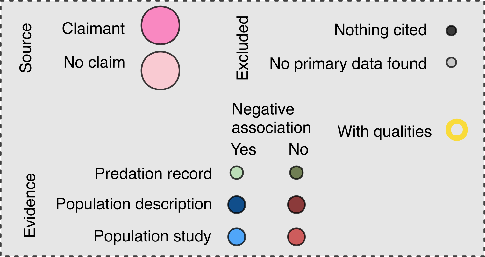

# Prepare environment & load data {#sec-prep}
```{r}
#| eval: true
#| echo: true

rm(list = ls())
library("data.table")
library("dplyr")
library("tidyr")
library("ggplot2")
library("igraph")
library("tidygraph")
library("ggraph")
library("readxl")
library("stringr")
library("patchwork")
library("glmmTMB")
library("broom")
library("broom.mixed")
library("cowplot")

```

The data for this analysis consists of two files, one for the nodes (e.g., each article) and one for the edges (the citations between articles).

```{r}
#| eval: true
#| echo: true
nodes <- fread("builds/citation_network/nodes_tidied.csv")
head(nodes)

edges <- fread("builds/citation_network/edges_tidied.csv")
head(edges)
```

These files have been cleaned and pre-processed in `scripts/2_analysis/1 citation networks and bias.R` and are ready to be used to create a network.

## Create citation network

```{r}
#| eval: true
#| echo: true
igraph.gr <- igraph::graph_from_data_frame(d = edges, 
                                           vertices = nodes,
                                           directed = T)
igraph.gr


graph <- tidygraph::as_tbl_graph(igraph.gr)
```


## Plot
Now, we'll format factor levels, create color and size aesthetics and plot this:

```{r}
#| eval: true
#| echo: true
#| fig-width: 9
#| fig-height: 7

unique(nodes$evidence_type_synthetic_simple)
labels <- c(`Core claim` = "Core claim", 
            `External review without claim` = "External source without claim", 
            `Nothing cited` = "Nothing cited",
            `Excluded` = "No primary data found", 
            `Predation in support without data` = "Predation record without data", 
            `Predation not in support without data` = "Predation record without data", 
            `Population in support without data` = "Population - description", 
            `Population in support with data` = "Population - study",
            `Population not in support without data` = "Population - description", 
            `Population not in support with data` = "Population - study")

node_fill <- c(`Core claim` = "hotpink", `External review without claim` = "pink", 
               Excluded = "grey", `Nothing cited` = "black", 
               `Predation in support without data` = "#a6d3a0", 
               `Predation not in support without data` = "#40531b", 
               `Population not in support without data` = "indianred4", `Population not in support with data` = "indianred", 
               `Population in support without data` = "dodgerblue4", `Population in support with data` = "dodgerblue"
)
node_size <- c(`Core claim` = 5, `External review without claim` = 5, `Opportunistic` = 1,
               Excluded = 1, 
               `Predation without data` = 2, #`Control program without data` = 2, 
               `Population without data` = 3, `Population with data` = 4)

unique(nodes$of_quality)
stroke_color <- c("no" = "black", 
                  "yes" = "gold")

stroke_width <- c("no" = .01, 
                  "yes" = 2)

setdiff(unique(nodes$evidence_type_synthetic_simple),
        names(labels))
setdiff(names(labels),
        unique(nodes$evidence_type_synthetic_simple))

p1 <- ggraph(graph, layout = "kk")+
  geom_edge_fan(arrow = arrow(length = unit(1, 'mm')), 
                start_cap = circle(1, 'mm'),
                end_cap = circle(1, 'mm'),
                color = "grey50",
                alpha = .5,
                linewidth = 0.25) + 
  geom_node_point(aes(fill = evidence_type_synthetic_simple,
                      color = of_quality,
                      stroke = of_quality,
                      size = evidence_type_simple), 
                  shape = 21, 
                  alpha = .75)+
  scale_fill_manual("Article type",
                    values = node_fill,
                    labels = labels)+
  scale_size_manual("Article type",
                    values = node_size *2,
                    breaks = levels(nodes$evidence_type_simple))+ 
  guides(size = "none",
         fill = "none",
         color = "none",
         stroke = "none")+
  scale_discrete_manual("Quality research",
                        aesthetics = "stroke", 
                        values = c(1, 2))+
  scale_color_manual("Quality research",
                     values = stroke_color )+
  theme_graph()+
  theme(legend.position = 'bottom')
p1

```
And the formatted legend:




# Probability of being cited
Now, let's evaluate the terminus of each citation chain from the core claimant sources (the large bright pink points). What is the probability that those citation chains end in **population studies**?

We'll load a separate data frame produced by `scripts/3 create probability of being cited dataset.R`. This dataset is organized as claimant-claimant-source article pairs. Each row is a *potential* citation. The colum `cited` (0 or 1) indicates whether the article was cited or not. Pairs are constrained by species and publication timing (e.g., articles published after claimant reviews were finished are excluded).

This dataset allows us to evaluate whether claimants cited available evidence.

Load data and filter to only claimant sources:
```{r}
#| eval: true
#| echo: true

terminus_exploded_filtered <- fread("builds/citation_network/citation_probability.csv")

# Filter to only claimant sources
terminus_exploded_filtered[, making_claim := ifelse(grepl("_claim", 
                                                          cited_by_id), 
                                                    "CLAIM", 
                                                    "NO_CLAIM")]
terminus_exploded_filtered <- terminus_exploded_filtered[making_claim == "CLAIM", ]
head(terminus_exploded_filtered)
```

Now we'll do a binomial model on articles that are population studies with data. We'll also manually calculate the percent of available population studies with data that were cited:
```{r}
#| eval: true
#| echo: true
#| fig-width: 9
#| fig-height: 7

# >>> Model -----------------------------------------------------------------
# Overall:
m <- glmmTMB(cited ~ 1 + (1|cited_by_id) + (1|scientificName),
             family = binomial(link = "logit"),
             data = terminus_exploded_filtered[grepl("Population", evidence_type_synthetic) &
                                                 has_data == "yes", ])

summary(m)

```

Now let's evaluate whether there was a difference in citations between evidence in support or not of the hypothesis and plot this:
```{r}
#| eval: true
#| echo: true
#| fig-width: 9
#| fig-height: 7

m <- glmmTMB(cited ~ in_support + (1|cited_by_id) + (1|scientificName),
             family = binomial(link = "logit"),
             data = terminus_exploded_filtered[grepl("Population", evidence_type_synthetic) &
                                                 has_data == "yes" &
                                                 making_claim == "CLAIM", ])
summary(m)
tidy(m)

pred <- predict(m, data.table(in_support = c("Yes", "No")),
                re.form = NA, se = TRUE)

# predict_response(m)
# summary(m)
pred <- as.data.frame(pred) |> setDT()
crit <- qnorm(0.975)
pred[, lower_ci := fit - (se.fit * 1.96)]
pred[, upper_ci := fit + (se.fit * 1.96)]
pred[, fit := plogis(fit)]
pred[, lower_ci := plogis(lower_ci)]
pred[, upper_ci := plogis(upper_ci)]

#
pred$in_support <- c("Yes", "No")
pred

# Hmmm. 
citation.p <- ggplot(data = pred, 
                     aes(x = in_support, 
                         fill = in_support, y = (fit), 
                         ymin = (lower_ci), ymax = (upper_ci)))+
  geom_errorbar(position = position_dodge(width = .75), width = .25)+
  geom_point(position = position_dodge(width = .75),
                  shape = 21, size = 4)+
  ylab("Probability (±95% CIs) of a claimant citing\nan available population study with data")+
  scale_fill_manual("In support",
                    values = c("No" = "indianred", "Yes" = "dodgerblue"))+
  xlab("Negative association\nfound")+
  theme_bw()+
  theme(panel.border = element_blank(),
        panel.grid = element_blank(),
        legend.position = "none")
citation.p
```

And let's summarize the percent cited with descriptive statistics:
```{r}
out <- terminus_exploded_filtered[grepl("Population", evidence_type_synthetic) &
                                    has_data == "yes", .(n = .N),
                                  by = .(cited, scientificName, cited_by_id, in_support)]
out <- dcast(out,
             scientificName + in_support + cited_by_id ~ cited, value.var = "n",
             fill = 0)
out[, total := `0` + `1`]
out[, perc_cited := `1` / total * 100]

out[, .(mean = mean(perc_cited), sd=sd(perc_cited)),
    by = .(in_support)]

```
On average, claimants cited between 17 and 23% of available population studies with data (sd=±36.8, 39.8)

# Summaries of evidence cited


