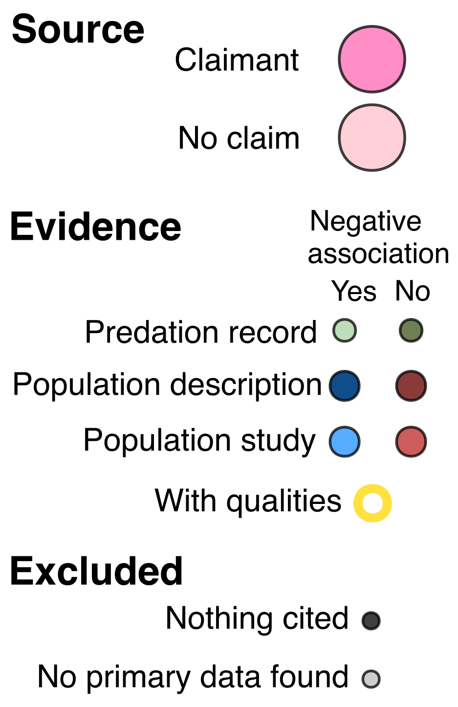

To explore the citation networks at a more granular level please select a species in the dropdown menu, which also allows you to search for a species by scientific name. Please see reference section of the article for full citations given in the Reference section. References tagged as “core source” were reviews used as starting points for the citation network that made claims that the species was threatened by cats. "Systematic (this article)" refers to sources identified during our systematic search of Web of Science, alongside articles encountered opportunistically. All articles encountered during snowball searching are linked explicitly to their source in the network. Note that some references might occur more than once if they provided multiple lines of evidence (e.g., different studies). 

:::: {.columns}

::: {.column width = "85%"}

```{shinylive-r}
#| standalone: true
#| viewerHeight: 600

suppressPackageStartupMessages({
  library("shiny")
  library("data.table")
  library("tidygraph")
  library("ggraph")
})

# Prepare data and labels:
# download.file("https://ejlundgren.github.io/cat_evidence_review/builds/citation_network/nodes_tidied.csv", "nodes.csv")
# download.file("https://ejlundgren.github.io/cat_evidence_review/builds/citation_network/edges_tidied.csv", "edges.csv")
# Data had to be dputted...So 12k lines ofcode...

# Load data ---------------------------------------------
nodes <- readRDS(url("https://raw.githubusercontent.com/ejlundgren/cat_evidence_review/main/builds/citation_network/nodes_tidied.Rds"))
edges <- readRDS(url("https://raw.githubusercontent.com/ejlundgren/cat_evidence_review/main/builds/citation_network/edges_tidied.Rds"))

# Prepare for app ----------------------------------------------------------
labels <- c(`Core claim` = "Claimant", 
            `External review without claim` = "Non-claimant", 
            `Nothing cited` = "Nothing cited",
            `Excluded` = "No primary data found", 
            `Predation in support without data` = "Predation record without data", 
            `Predation not in support without data` = "Predation record without data", 
            `Population in support without data` = "Population - description", 
            `Population in support with data` = "Population - study",
            `Population not in support without data` = "Population - description", 
            `Population not in support with data` = "Population - study")

node_fill <- c(`Core claim` = "hotpink", `External review without claim` = "pink", 
               Excluded = "grey", `Nothing cited` = "black", 
               `Predation in support without data` = "#a6d3a0", 
               `Predation not in support without data` = "#40531b", 
               `Population not in support without data` = "indianred4", `Population not in support with data` = "indianred", 
               `Population in support without data` = "dodgerblue4", `Population in support with data` = "dodgerblue"
)
node_size <- c(`Core claim` = 5, `External review without claim` = 5, `Opportunistic` = 2,
               Excluded = 2, 
               `Predation without data` = 3, #`Control program without data` = 2, 
               `Population without data` = 4, `Population with data` = 5)

stroke_color <- c("no" = "black", 
                  "yes" = "gold")

stroke_width <- c("no" = .01, 
                  "yes" = 2)

# Shiny app ----------------------------------------------------------------------
ui <- fluidPage(
  titlePanel(""),
  sidebarLayout(
    sidebarPanel(
      selectInput(
        inputId = "spp",
        label = "Select a species",
        choices = sort(unique(edges$scientificName)),
        selected = sort(unique(edges$scientificName))[1]
      ),
      
      htmlOutput(outputId = "references")
      
    ),
    mainPanel(
      plotOutput(outputId = "citationPlot")
    )
  )
)

server <- function(input, output) {
  output$citationPlot <- renderPlot({
    edges.sub <- edges[scientificName %in% input$spp, ]
    nodes.sub <- nodes[node_id %in% unique(c(edges.sub$cited_by_id,
                                              edges.sub$article_id)), ]
    unique(nodes.sub$evidence_inclusion)
    
    # Sort so that factor levels are assigned first to claimants and then external reviews and then included studies and then excluded:
    nodes.sub$evidence_inclusion <- factor(nodes.sub$evidence_inclusion,
                                           levels = c("claim", "Systematic review (this article)", 
                                                      "external review without claim", "INCLUDE",
                                                      "EXCLUDE"))
    setorder(nodes.sub, evidence_inclusion, node_id)
    
    nodes.sub[, node_label := as.numeric(factor(node_id, levels = unique(node_id)))]
    igraph.gr <- igraph::graph_from_data_frame(d = edges.sub, 
                                           vertices = nodes.sub,
                                           directed = T)
    igraph.gr

    graph <- tidygraph::as_tbl_graph(igraph.gr)
    
    ggraph(graph, layout = "fr")+
        geom_node_point(aes(fill = evidence_type_synthetic_simple,
                            color = of_quality,
                            stroke = of_quality,
                            size = evidence_type_simple), 
                        shape = 21, 
                        alpha = .75)+
        geom_edge_fan(arrow = arrow(length = unit(3, 'mm')), 
                      start_cap = circle(5, 'mm'),
                      end_cap = circle(5, 'mm'),
                      color = "black",
                      # alpha = .5,
                      # disconnect = TRUE ,
                      linewidth = 0.5) + 
        geom_node_label(aes(label = node_label),
                        nudge_y = 0.1,
                        vjust = 0)+
        scale_fill_manual("Article type",
                          values = node_fill,
                          labels = labels)+
        scale_size_manual("Article type",
                          values = node_size *2,
                          breaks = levels(nodes$evidence_type_simple))+ 
        guides(size = "none",
               fill = "none",
               color = "none",
               stroke = "none")+
        scale_discrete_manual("Quality research",
                              aesthetics = "stroke", 
                              values = c(1, 2))+
        scale_color_manual("Quality research",
                           values = stroke_color )+
        theme_graph()+
        theme(legend.position = 'bottom')
  })
  
  output$references <- renderUI({
    edges.sub <- edges[scientificName %in% input$spp, ]
    nodes.sub <- nodes[node_id %in% unique(c(edges.sub$cited_by_id,
                                              edges.sub$article_id)), ]
   unique(nodes.sub$evidence_inclusion)
    # Sort so that factor levels are assigned first to claimants and then external reviews and then included studies and then excluded:
    nodes.sub$evidence_inclusion <- factor(nodes.sub$evidence_inclusion,
                                           levels = c("claim", "Systematic review (this article)", 
                                                      "external review without claim", "INCLUDE",
                                                      "EXCLUDE"))
    setorder(nodes.sub, evidence_inclusion, node_id)
    
    nodes.sub[, node_label := as.numeric(factor(node_id, levels = unique(node_id)))]
    
    #
    nodes.sub[, node_name_clean := ifelse(grepl("NOTHING", article_node_name),
                                          "Nothing cited", 
                                          article_node_name)]
    nodes.sub[grepl("Systematic", article_node_name), node_name_clean := "Systematic (this article)"]
    nodes.sub[!grepl("Systematic", article_node_name), node_name_clean := gsub("(", "", node_name_clean, fixed = TRUE)]
    nodes.sub[!grepl("Systematic", article_node_name), node_name_clean := gsub(")", "", node_name_clean, fixed = TRUE)]
    nodes.sub[grepl("IUCN", article_node_name), node_name_clean := gsub("(2025)", "", node_name_clean, fixed = TRUE)]
    nodes.sub[, node_description := paste0(node_label, ": ", node_name_clean)]
    
    setorder(nodes.sub, node_label)
    HTML(paste("<b>References:</b><br>",
          paste(nodes.sub$node_description, collapse = "<br>")))
  })
}
shinyApp(ui = ui, server = server)
```
:::

::: {.column width = "15%"}
<br>

<figure>
  
  <!-- style="width: 100%; height: auto;" -->
</figure>
:::

::::


