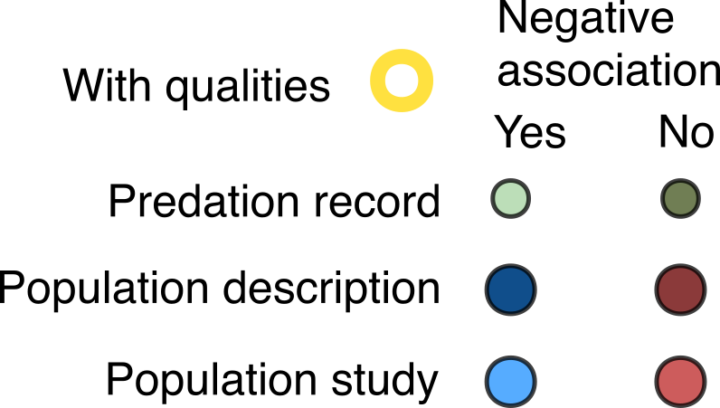

This section will tally the evidence types encountered. This workflow is derived from a full R script in `scripts/2_analysis/2 meta and review summary.R` that includes additional checks and tests and is fully interactive if you clone the repo. 

# Prepare environment & load data:
```{r}
#| eval: true
#| echo: true

rm(list = ls())

library("data.table")
library("metafor")
library("ggplot2")
library("orchaRd")
library("patchwork")
library("readxl")
library("stringr")
library("ggstance")
library("sf")
library("mapview")
library("tidyr")
library("broom")
library("broom.mixed")
library("dplyr")
library("rotl")
library("ape")
library("gt")
library("ggtext")

sys_rev <- fread("builds/systematic_review/systematic_review_tidy.csv")
sys_rev

```

This dataset was initially cleaned in `scripts/1_data_mgmt/4 clean systematic review and claim.R`.

# Plot evidence types found
Now we'll do some quality control checks, clean up factor levels, create color palettes and plot this:

```{r}
#| eval: true
#| echo: true
#| fig-width: 5
#| fig-height: 5

sys_rev[spp_name_corrected == "Dasyurus maculatus"]$exclude_species
sys_rev <- sys_rev[exclude_species == "included_species",]
n_studies <- sys_rev[, .(n_studies = uniqueN(study_id)),
                     by = .(evidence_type, has_data, of_quality, Hypothesis_supported,
                            class)]
head(n_studies)

n_studies[, synth_fill := fcase(grepl("Population", evidence_type) & 
                                  has_data == "yes", paste(evidence_type, "with data"),
                                grepl("Population", evidence_type) & 
                                  has_data == "no", paste(evidence_type, "without data"))]

n_studies[is.na(synth_fill), synth_fill := evidence_type]
# n_studies[of_quality == "yes",]
n_studies[of_quality == "yes", synth_fill := paste(synth_fill, "and qualities")]

# Set up color palettes

fill_pal <- c(`Predation in support` = "#a6d3a0", 
              `Predation not in support` = "#40531b", 
              `Population not in support without data` = "indianred4", 
              `Population not in support with data` = "indianred", 
              `Population not in support with data and qualities` = "indianred", 
              `Population in support without data` = "dodgerblue4", 
              `Population in support with data` = "dodgerblue",
              `Population in support with data and qualities` = "dodgerblue"
              )
#
n_studies$synth_fill <- factor(n_studies$synth_fill,
levels = (c("Predation not in support", 
            "Predation in support", 
            "Population not in support without data",
            "Population not in support with data", 
            "Population not in support with data and qualities",
            "Population in support without data", 
            "Population in support with data", 
            "Population in support with data and qualities" 
            )))

#
n_studies[, evidence_simple := fcase(grepl("Predation", evidence_type), "Predation",
                                     grepl("Population", evidence_type), "Population")]

# n_studies[evidence_simple %in% "Population" & class == "Birds"]
# n_studies.alt[class %in% c("Reptiles", "Amphibians"), class := "Reptiles & Amphibians"]
n_studies$class <- factor(n_studies$class,
                              levels = c("Birds", "Reptiles", "Mammals", "Amphibians"))
n_studies$Hypothesis_supported <- factor(n_studies$Hypothesis_supported ,
                                             levels = c(1, 0))
p.sys <- ggplot(data = n_studies, 
                aes(x = (Hypothesis_supported), 
                    y = abs(n_studies), fill = synth_fill, color = of_quality))+
  geom_col(lwd = 1)+ 
  ylab("Number of studies")+
  facet_wrap(~class, scales = "free_x",
             strip.position = "bottom", nrow = 1)+
  xlab(NULL)+
  scale_fill_manual(name = NULL,
                    values = fill_pal)+
  scale_color_manual(name = "With qualities",
                     values = c("no" = "transparent",
                                "yes" = "gold"))+
  theme_bw()+
  theme(panel.grid = element_blank(),
        axis.ticks.x = element_blank(),
        axis.text.x = element_blank(),
        legend.position = "none",
        strip.background = element_blank(),
        panel.border = element_blank())

p.sys

```


# Best evidence
Let's now look at the best evidence available per species. To do this, we rank evidence types and select the highest quality type per claimant and species. To do this we also need all claims, e.g., a dataset based on whether a source claimed that cats were a cause of endangerment of a species. We'll merge the evidence found into this dataset.

```{r}
#| eval: true
#| echo: true
#| fig-width: 5
#| fig-height: 5

claims <- fread("builds/claims/species_claims_tidy_populated.csv")

# Filter to only included species:
claims <- claims[exclude_species == "included_species", .(spp_name_corrected, scientificName, 
                                                          realm, systems, redlistCategory,
                                                          populationTrend, class)] |> unique()

# Fix the one species that has been split since assessment:
claims[spp_name_corrected == "Prosobonia parvirostris", spp_name_corrected := scientificName]
#

# Copy the systematic review evidence file into a new data structure
ranking <- copy(sys_rev)
ranking <- ranking[, .(spp_name_corrected,
                       of_quality, evidence_type, has_data)]
unique(ranking$has_data)

sort(unique(ranking$evidence_type))

ranking[of_quality == "yes" &
          evidence_type == "Population in support", rank := 10]
ranking[of_quality == "no" &
          has_data == "yes" &
          evidence_type == "Population in support", rank := 9]
ranking[of_quality == "no" &
          has_data == "no" &
          evidence_type == "Population in support", rank := 8]
ranking[evidence_type == "Predation in support", rank := 7]

unique(ranking[is.na(rank)]$evidence_type)

ranking[is.na(rank), rank := 0]
ranking[rank == 0, evidence_type := "No evidence in support"]
ranking[rank == 0, has_data := NA]
ranking[rank == 0, of_quality := NA]

ranking <- ranking[, max_rank := max(rank),
                   by = .(spp_name_corrected)]
ranking[, no_evidence := .N, by = .(spp_name_corrected)]
ranking[no_evidence > 1, ]
ranking <- ranking[rank == max_rank, ] |> unique()

ranking[duplicated(spp_name_corrected), ] # Must be 0 rows

# Now merge into the claims:
best_evidence <- merge(claims,
                       ranking[, .(spp_name_corrected, evidence_type, of_quality,
                                   has_data)],
                       by = "spp_name_corrected",
                       all.x = T,
                       all.y = T)

best_evidence[duplicated(spp_name_corrected)]

#
best_evidence[is.na(redlistCategory)] # Must be 0 rows
unique(best_evidence$class)
best_evidence[is.na(redlistCategory), class := "Mammals"]

# 
best_evidence[is.na(evidence_type), evidence_type := "No evidence found"]

best_evidence[is.na(of_quality), of_quality := "no"]
best_evidence[is.na(has_data), has_data := "no"]

best_evidence[grepl("Population", evidence_type), 
              synth_fill := paste(evidence_type, 
                                    ifelse(has_data == "yes", 
                                           "with data", "without data")) |> trimws()]
best_evidence[grepl("Population", evidence_type), 
              synth_fill := paste(synth_fill, 
                                    ifelse(of_quality == "yes",
                                           "and qualities", "")) |> trimws()]
setdiff(best_evidence$synth_fill, names(fill_pal))
best_evidence[is.na(synth_fill), synth_fill := evidence_type]
setdiff(best_evidence$synth_fill, names(fill_pal))

fill_pal2 <- c(`Predation in support` = "#a6d3a0", 
               `Population in support without data` = "dodgerblue4", 
               `Population in support with data` = "dodgerblue", 
               `Population in support with data and qualities` = "dodgerblue",
               `No evidence in support` = "grey40",
               `No evidence found` = "black")

unique(best_evidence$class)


best_evidence.freq <- best_evidence[, .(n_species = uniqueN(scientificName)),
                                    by = .(synth_fill,
                                           of_quality, class)]
#
best_evidence.freq[duplicated(paste(synth_fill, class)),]

unique(best_evidence.freq$synth_fill)
best_evidence.freq$synth_fill <- factor(best_evidence.freq$synth_fill,
                      levels = rev(c("No evidence found", 
                                     "No evidence in support", 
                                     "Predation in support",
                                     "Population in support without data",
                                     "Population in support with data",
                                     "Population in support with data and qualities")))

unique(best_evidence.freq$class)

best_evidence.freq$class <- factor(best_evidence.freq$class,
                                   levels = (c("Birds", "Reptiles", "Mammals",  "Amphibians")))

best.p <- ggplot(data = best_evidence.freq,
       aes(x = class, y = n_species, fill = synth_fill,
           color = of_quality))+
  geom_col(position = position_stack(), width = .75)+
  scale_fill_manual("Best evidence",
                    values = fill_pal2)+
  scale_color_manual("Of quality", 
                     values = c("no" = "transparent",
                                "yes" = "gold"))+
  guides(fill = guide_legend(nrow = 3),
         color = "none")+
  ylab("Number of species")+
  xlab(NULL)+
  theme_bw()+
  theme(panel.border = element_blank(),
        legend.position = "bottom",
        panel.grid = element_blank())
best.p

```

